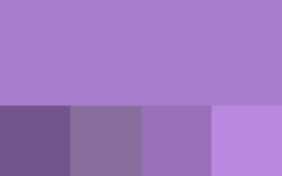
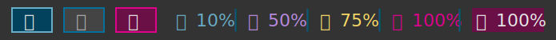

# Color Scheme

The color scheme used for the Monster theme.

## Colors

These are the colors used by the Monster themes.

### Teals

The main detailing colors of the Monster theme

### Magentas

Primarily for things that wants urgent attention. Also used for warnings that wants some sort of action from the user.

### Greens

Things thats going to plan, is successful or asking confirmation may use the greens

### Yellows

Mostly used for decoration but, may used for warnings before they get dangerous or needs action.

### Purples

Mostly used for decoration but, may be used for things that wants attention but are not critical in any way.

### Blues

Decoration color when the main colors are not sufficient. Doesn't usually have a significant meaning.

### Grays

Mostly used for backgrounds

## Examples

This is how the colors may be used in the Monster theme.

### Text

With the most common backgrounds

### Status bar

With the most common styles

