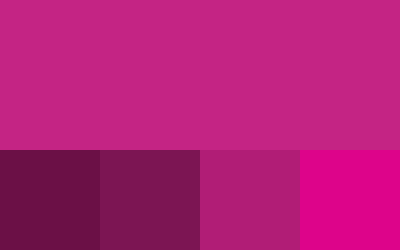
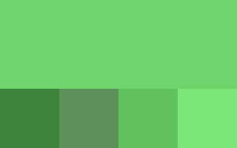
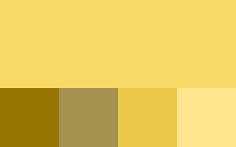
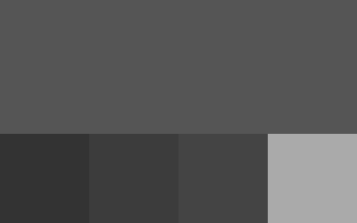
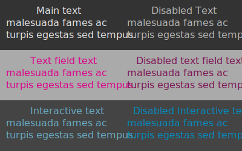

# Color Scheme

The color scheme used for the Monster theme.

## Blues

The main detailing colors of the Monster theme

## Magentas

Primarily for things that wants attention without being dangerous

## Greens

Things thats going to plan, is successful or asking confirmation may use the greens

## Yellows

Mostly used for decoration but, may used for warnings before they get dangerous

##Greys
 
Mostly used for backgrounds

## Text color

With the most common backgrounds

